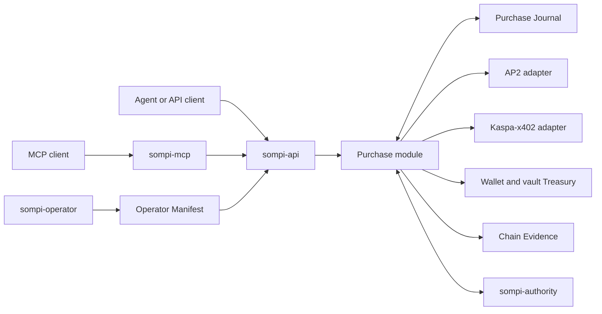

# Sompi

Sompi is a testnet-first purchasing and treasury runtime for agents on Kaspa.
An agent can request a purchase, but it cannot approve the purchase, access
keys, alter policy, or decide whether a payment succeeded.

Sompi joins three systems without merging their responsibilities:

- **AP2 v0.2 human-present**: Merchant terms, human authorization, and receipts.
- **Kaspa-x402 `0.1.0-alpha.8`**: x402 payment negotiation and Kaspa settlement.
- **Sompi Purchase**: durable orchestration, policy, recovery, fulfilment, and
  evidence joins.

The supported network is `kaspa:testnet-10`. Mainnet is disabled.

## Supported scope

| Capability | Status |
|---|---|
| Canonical Purchase API | Supported |
| MCP compatibility wrapper | Supported |
| AP2 human-present authorization | Supported, experimental native-KAS profile |
| Kaspa-x402 `standard-native` exact | Supported, default |
| Kaspa-x402 `additive` exact | Supported, optional |
| Kaspa-x402 batch settlement | Supported as a separate authorized channel lifecycle |
| Autonomous AP2, passkeys, UCP | Not supported |
| Mainnet | Not supported |

## Architecture



`sompi-api` is the trusted runtime. It owns the Journal, wallet, vault,
protocol adapters, policy enforcement, and recovery.

`sompi-mcp` is an untrusted, stateless compatibility process. It calls the API
and owns no payment or authorization capability. Removing MCP would not change
Purchase behavior.

`sompi-authority` is a separate deterministic process. It displays the exact
Purchase facts through the operator-selected terminal or Telegram provider and
signs only the resulting request-bound decision. The agent cannot call this
decision interface.

`sompi-operator` installs the immutable Operator Manifest and local API
credentials. It is not an agent tool or long-running service.

## Purchase interface

The API is the canonical interface:

| Operation | Route |
|---|---|
| Create or resume | `POST /purchases` |
| Read status | `GET /purchases/{purchaseId}` |
| Recover | `POST /purchases/{purchaseId}/recover` |

Production API traffic uses pre-provisioned Unix sockets. There is no TCP
listener. Agent traffic and operator recovery use separate sockets,
credentials, groups, connection pools, and work budgets.

MCP exposes the same lifecycle through exactly three tools:

- `purchase`
- `purchase_status`
- `purchase_recover`

The OpenAPI 3.2 and Arazzo 1.1 descriptions are under
[`docs/openapi/`](docs/openapi/).

## Agent integration

Agents use `sompi-agent`, which talks only to the local Purchase API:

```bash
sompi-agent purchase --request-key TASK_KEY --url HTTPS_URL --method GET
sompi-agent status PURCHASE_ID
sompi-agent recover PURCHASE_ID
```

Hermes uses the packaged skill for those commands. A small callback plugin
returns Authority-created Telegram button decisions to `sompi-authority`; it
has no wallet, signer, policy, Journal, or API credential. MCP is optional and
is not used by this integration.

See [`docs/runbooks/HERMES.md`](docs/runbooks/HERMES.md) for the one-time host
setup.

## Payment behavior

Both exact profiles use `kaspa-exact-v2`:

- `standard-native` creates an ordinary version-0 KAS payment.
- `additive` advances a reusable KIP-10-based head. The successor delta is the
  complete Merchant payment; there is no second Merchant output.

Batch settlement is not an exact profile. It is a separately capitalized
channel. Every voucher increase requires its own human-present Purchase
authorization and durable capacity reservation.

Before any irreversible effect, Sompi stores the intent, authorization,
reservation, prepared material, idempotency identity, and recovery fence. A
timeout never means “pay again.” Recovery observes the saved transaction,
Merchant state, and trusted chain evidence before advancing.

## Development

Requires Node.js 22 or newer.

```bash
git clone https://github.com/elldeeone/sompi.git
cd sompi
npm ci
npm test
```

Useful checks:

```bash
npm run proof:e2e-local
npm run test:conformance
node scripts/verify-release.mjs
```

The local proof uses deterministic in-memory Testnet-10 fixtures. Funded
network evidence is recorded separately under
[`evidence/live-testnet10/`](evidence/live-testnet10/README.md).

## Operator deployment

The testnet deployment uses distinct principals:

- operator/root: installs the manifest and credentials;
- `sompi-api`: trusted Purchase runtime and payment state owner;
- `sompi-mcp`: untrusted API client;
- `sompi-authority`: human-present signer.

Start here:

1. [`docs/runbooks/OPERATOR_PROVISIONING.md`](docs/runbooks/OPERATOR_PROVISIONING.md)
2. [`docs/runbooks/AUTHORITY.md`](docs/runbooks/AUTHORITY.md)
3. [`docs/runbooks/HERMES.md`](docs/runbooks/HERMES.md)
4. [`docs/runbooks/JOURNAL.md`](docs/runbooks/JOURNAL.md)
5. [`docs/runbooks/RECONCILIATION.md`](docs/runbooks/RECONCILIATION.md)

Do not operate persistent funds until those boundaries are installed and
verified. Testnet keys are software keys. This release is not production or
mainnet ready.

## Source of truth

Read the current design in this order:

1. [`CONTEXT.md`](CONTEXT.md)
2. [`docs/architecture/SOMPI_ARCHITECTURE.md`](docs/architecture/SOMPI_ARCHITECTURE.md)
3. [`docs/adr/`](docs/adr/README.md)
4. [`docs/IMPLEMENTATION_PLAN.md`](docs/IMPLEMENTATION_PLAN.md)
5. [`CURRENT_STATE.md`](CURRENT_STATE.md)

Protocol objects are retained as immutable evidence attachments. They are not
Sompi domain state. AP2 and Kaspa-x402 remain independent adapters, and Sompi
does not modify either protocol.

## License

MIT. See [`LICENSE`](LICENSE). Vendored dependencies retain their own licences.
