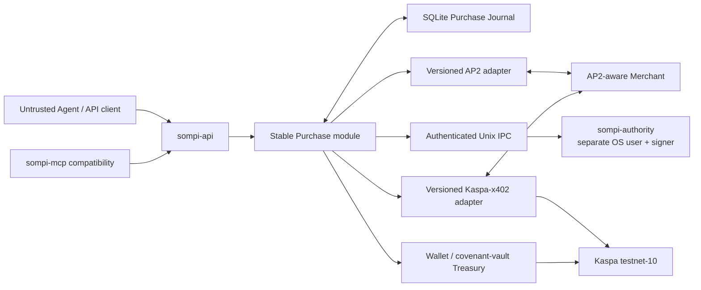

# Sompi

Sompi is a testnet-first agent treasury and purchasing system for Kaspa. It
lets an Agent express a resource-purchase intent while keeping human approval,
Merchant commerce authorization, payment execution, policy accounting, and
crash recovery in deterministic non-agentic modules.

The initial profile composes two evolving protocols without merging them:

- **AP2 v0.2 human-present** owns Merchant checkout evidence, exact human
  authorization, closed mandates, and receipts.
- **Kaspa-x402 `0.1.0-alpha.8`** owns `kaspa-exact-v2` requirements,
  `standard-native` and `additive` payment execution, and Kaspa Settlement.
- **Sompi Purchase** binds both sides through canonical facts, identifiers, and
  evidence digests. It adds no proprietary AP2 fields to x402 objects.

Native KAS in AP2 is an explicitly experimental Sompi profile because AP2
v0.2's standardized amount model does not define KAS/sompi. The first release
supports only `kaspa:testnet-10`; mainnet is intentionally unavailable.

## Architecture



The stable centre depends on narrow Sompi-owned interfaces. AP2 and
Kaspa-x402 are adapters at the edge, pinned by an explicit supported-profile
declaration and tested with conformance fixtures. Either adapter can evolve or
be replaced without changing Purchase state or smuggling one protocol into the
other.

Checkout discovery follows the same boundary: Sompi bounds and joins the HTTP
artifacts, AP2 verifies a Merchant Checkout containing only an opaque payment
requirements digest, and Kaspa-x402 independently verifies the corresponding
`PAYMENT-REQUIRED` bytes. A structural test prevents the two adapter trees from
importing each other.

Read the design in this order:

1. [`CONTEXT.md`](CONTEXT.md)
2. [`docs/architecture/SOMPI_ARCHITECTURE.md`](docs/architecture/SOMPI_ARCHITECTURE.md)
3. [`docs/adr/`](docs/adr/README.md)
4. [`docs/IMPLEMENTATION_PLAN.md`](docs/IMPLEMENTATION_PLAN.md)
5. [`CURRENT_STATE.md`](CURRENT_STATE.md)

## What is durable

One SQLite-backed journal is the source of truth for:

- Purchase intent, Checkout Terms, authority decisions, AP2 evidence, payment
  attempts, Settlement, Fulfilment, and receipts;
- immutable prepared transaction bytes and planned external effects;
- ambiguity observations, fencing leases, and deterministic recovery;
- policy snapshots, reservations, in-flight capacity, and observed spend;
- direct `send_payment`, `vault_send`, and `vault_deposit` operations.

An interrupted operation is recovered using its original `purchaseId`,
`requestKey`, or `operationKey`. Sompi observes the exact saved transaction and
inputs before any proof-backed resubmission; it never treats a timeout as
permission to pay again.

## Development quick start

Requires Node.js 22 or newer.

```bash
git clone https://github.com/elldeeone/sompi.git
cd sompi
npm ci
npm test
```

Run the deterministic full vertical proof:

```bash
npm run proof:e2e-local
```

That proof exercises real Sompi AP2 artifacts, authority IPC framing, Merchant
authorization, vault staging, unchanged Kaspa-x402 exact calls, independent
chain verification, fulfilment, receipts, restarts, and idempotency against a
deterministic in-memory testnet fixture. It deliberately does **not** claim a
live-network result or real OS-user isolation.

The protocol conformance command verifies cross-language AP2 artifacts and the
pinned Kaspa-x402 adapter contract:

```bash
npm run test:conformance
```

Its first run populates a private exact-commit/Python cache; set
`SOMPI_CONFORMANCE_OFFLINE=1` to prove subsequent download-free replay.

Live testnet evidence and exact limitations are recorded in
[`CURRENT_STATE.md`](CURRENT_STATE.md), never presented as mainnet readiness.

## Operator setup

The production-shaped runtime is not a one-process quickstart. Create two
distinct non-root users and follow
[`docs/runbooks/AUTHORITY.md`](docs/runbooks/AUTHORITY.md):

- `sompi-authority` owns its private AP2 signing key and foreground human
  approval terminal;
- `sompi-mcp` owns wallet/vault execution state and the Agent-facing MCP
  process;
- a dedicated group grants both users access only to the authenticated Unix
  socket;
- a root-only verifier proves that the MCP user cannot read the authority
  signer before startup.

Then configure the MCP command in the client using the environment established
by that runbook. A typical executable is:

```json
{
  "mcpServers": {
    "sompi": {
      "command": "/opt/sompi/node_modules/.bin/sompi-mcp",
      "env": {
        "SOMPI_NETWORK": "testnet-10",
        "SOMPI_OPERATOR_MANIFEST": "/etc/sompi/operator-manifest.json",
        "SOMPI_OPERATOR_UID": "0",
        "SOMPI_RUNTIME_GID": "1001",
        "SOMPI_AUTHORITY_CLIENT_DIR": "/var/lib/sompi-mcp-authority-client",
        "SOMPI_AUTHORITY_RUNTIME_DIR": "/run/sompi-authority",
        "SOMPI_AUTHORITY_SOCKET": "/run/sompi-authority/authority.sock"
      }
    }
  }
}
```

The immutable manifest owns the runtime path, policy, Merchant allowlist,
receipt issuers, node/witness profile, finality floors, and admission budgets.
The authority identifiers are omitted from this short example; startup fails
closed when any required deployment locator is absent.

## MCP tools

| Tool | Purpose |
|---|---|
| `purchase` | Start or idempotently resume one AP2-authorized, Kaspa-x402 exact Purchase |
| `purchase_status` | Read canonical Purchase state without an external effect |
| `purchase_recover` | Reconcile an interrupted Purchase without blind repayment |
| `payment_status` | Check wallet, vault, policy, journal, authority, and node readiness |
| `get_address`, `get_balance` | Receive-address and balance reads |
| `await_payment`, `verify_payment` | Observe incoming testnet payments |
| `send_payment` | Durable policy-gated hot-wallet send with a stable operation key |
| `vault_status` | Read the operator-provisioned consensus vault |
| `vault_deposit` | Durable initial funding or top-up of the vault |
| `vault_send` | Durable consensus-capped vault withdrawal |
| `treasury_operation_status` | Read one direct Treasury Movement |
| `treasury_operation_recover` | Reconcile one interrupted direct Treasury Movement |
| `estimate_fee`, `network_status` | Bounded node fee and health information |
| `get_policy` | Read the operator-owned software spending policy |

Every state-changing direct Treasury tool requires a caller-stable
`operationKey`. Every Purchase requires a caller-stable `requestKey`.

## Vault model

Sompi keeps ordinary working float in a hot wallet and intended purchasing
funds in a stateful Kaspa covenant vault. The Agent key can spend only within a
rolling-window consensus cap. An offline operator key can recover the vault
without Agent cooperation.

Generate the operator key outside the MCP session:

```bash
sompi-operator owner-key
```

Retain the private line offline. Put only the public line and desired cap in an
operator provisioning spec. Review it with `sompi-operator preview`, create a
sealed candidate with `provision`, and activate that exact digest with
`install`. The owner private key is never an MCP argument or runtime file.

The software policy remains an additional, stricter layer shared by Purchases
and direct Treasury Movements, but is now an immutable projection of the
Operator Manifest. See `operator.example.json` and the operator runbook.

## Required runtime configuration

| Variable | Purpose |
|---|---|
| `SOMPI_NETWORK` | Must be `testnet-10` in the initial release |
| `SOMPI_OPERATOR_MANIFEST` | Operator-owned canonical manifest path |
| `SOMPI_OPERATOR_UID` | Expected distinct manifest owner UID |
| `SOMPI_RUNTIME_GID` | Fixed read-only manifest group GID |
| `SOMPI_API_UID` | Trusted Purchase API process UID |
| `SOMPI_API_SOCKET` | Agent-facing permissioned Unix socket path |
| `SOMPI_AGENT_API_CREDENTIAL` | Operator-installed least-authority Agent bearer file |
| `SOMPI_RECOVERY_API_SOCKET` | Operator-only status/recovery Unix socket path |
| `SOMPI_RECOVERY_API_CREDENTIAL` | Operator-installed recovery bearer file |
| `SOMPI_RECOVERY_GID` | Operator-only recovery socket/credential group GID |
| `SOMPI_AUTHORITY_CLIENT_DIR` | MCP-owned IPC MAC copy and public trust store |
| `SOMPI_AUTHORITY_RUNTIME_DIR` | Shared socket directory |
| `SOMPI_AUTHORITY_SOCKET` | Authority Unix socket path |
| `SOMPI_AUTHORITY_SOCKET_UID` | Expected distinct authority owner UID |
| `SOMPI_AUTHORITY_SOCKET_GID` | Expected shared IPC group GID |
| `SOMPI_AUTHORITY_ISSUER` | Authority issuer expected by both processes |
| `SOMPI_AUTHORITY_IPC_KEY_ID` | IPC MAC key identifier expected by both processes |
| `SOMPI_AUTHORITY_INSTRUMENT_ID` | Experimental native-KAS AP2 instrument identifier |

The authority executable additionally accepts its private/client/runtime paths,
signing `kid`, and socket GID as described in its runbook.

## Security boundaries and limitations

- The Agent, prompts, Merchant prose, HTTP responses, RPC responses, and MCP
  arguments are untrusted.
- The authority independently verifies Merchant Checkout evidence and displays
  escaped canonical facts; approval requires typing the exact Purchase ID.
- Merchant AP2 authorization is a separate HTTP stage completed before Treasury
  staging. x402 receives only its standard payment request/header.
- All Merchant egress is allowlisted, DNS/IP pinned, redirect-revalidated,
  deadline-bound, and response-limited.
- Private keys, raw signed headers, prepared transactions, and arbitrary lower
  layer errors are excluded from MCP results.
- Testnet keys are software files with restrictive permissions. Hardware-backed
  authority signing, passkeys, autonomous mandates, batch settlement, UCP, and
  mainnet are deferred.

See [`docs/architecture/THREAT_MODEL.md`](docs/architecture/THREAT_MODEL.md) and
[`docs/runbooks/`](docs/runbooks/README.md) before operating persistent funds.

## Pinned protocol inputs

The supported-profile declaration pins AP2 v0.2 schemas/upstream provenance,
Kaspa-x402 `0.1.0-alpha.8` package integrities, source and release identities,
exact HTTP and consensus vectors, ES256/SD-JWT dependencies, and the
testnet-only profiles. Vendored AP2 schemas and Kaspa-x402 vectors retain their
upstream licences and provenance; Sompi source is MIT licensed.

The old Sompi x402 v1 escrow implementation and compatibility paths were
deleted at clean cutover. Kaspa-x402 remains an external package and is not
modified to understand AP2.

## License

MIT. See [`LICENSE`](LICENSE). Vendored components retain their own licenses.
