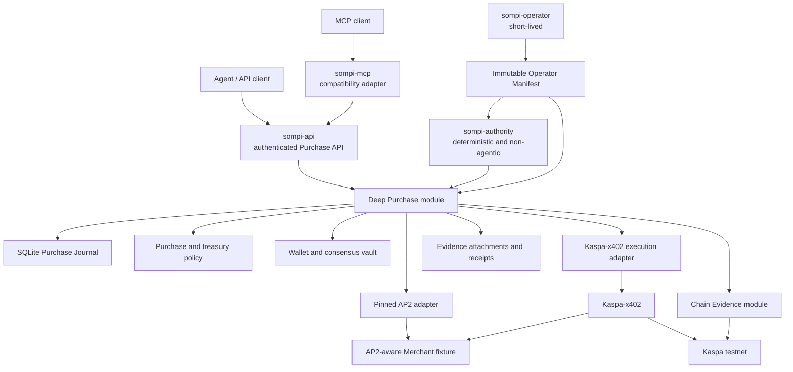
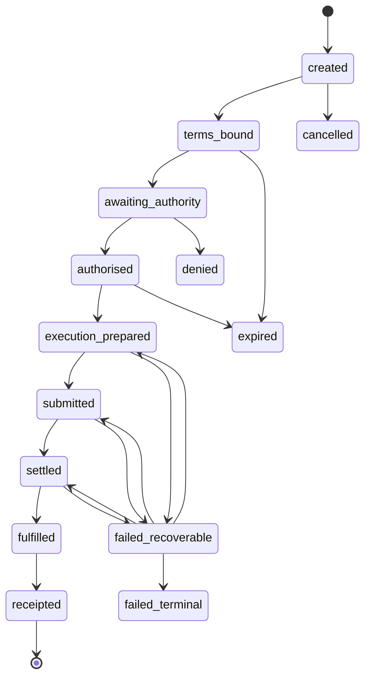
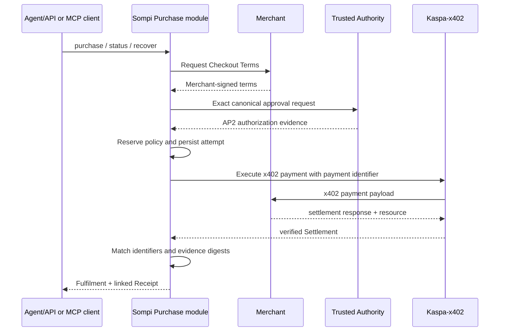

# Sompi target architecture

Status: **Accepted for implementation**

Accepted: **2026-07-11**; amended by ADR-0015 on **2026-07-16**

Applies to: the clean cutover after `ux-agent-native-payments`

## 1. Outcome

Sompi will become a modular monolith centred on one deep Purchase module. Its
stable interface is expressed in Sompi domain terms. AP2 and Kaspa-x402 sit at
separate seams so either can change without spreading protocol knowledge
through the wallet, policy, agent transports, journal, or receipts.

The repository remains one TypeScript package with three long-running
production executables, one short-lived administrative command, and one
development fixture:

- `sompi-api`: the canonical authenticated Purchase API and runtime;
- `sompi-mcp`: the untrusted compatibility executable that calls `sompi-api`;
- `sompi-authority`: the deterministic Trusted Authority executable;
- `sompi-operator`: the non-agentic Operator Provisioning command;
- demo Merchant: an end-to-end/conformance fixture, not a third production
  product.

This is a clean refactor of the current product, not a greenfield rewrite and
not a compatibility-preserving migration.

## 2. Architecture



The Purchase module earns its depth by owning discovery, term binding,
authorization, policy reservation, payment preparation, execution,
reconciliation, fulfilment, receipt construction, and status projection behind
one small interface. HTTP and MCP are adapters at that same seam. MCP has no
direct wallet, Journal, Authority, AP2, or Kaspa-x402 access.

## 3. Ownership

| Concern | Owner | Must not leak into |
|---|---|---|
| Canonical agent Purchase interface | Sompi API module | AP2 or x402 adapters |
| MCP compatibility tools and explanations | Sompi MCP adapter | Purchase implementation or credentials |
| Canonical Purchase lifecycle | Purchase module | Protocol SDK objects |
| Durable workflow and recovery | Purchase Journal | Ad-hoc JSON files |
| Purchase Authorization | Trusted Authority + AP2 adapter | Agent/LLM process |
| Treasury reservation and movement | Policy + wallet/vault modules | AP2 mandate semantics |
| Operator trust and configuration | Operator Provisioning module | Agent/MCP input or protocol wires |
| HTTP payment negotiation | x402/Kaspa-x402 | Sompi-owned wire encoders |
| Kaspa signing and settlement | Kaspa-x402 + Sompi funding adapters | AP2 adapter |
| Kaspa observation and finality policy | Chain Evidence module | x402 wire labels or per-caller RPC rules |
| Scarce operation admission | Owning Authority/Purchase/Treasury module | One global scheduler |
| Merchant terms and fulfilment | Merchant commerce implementation | Kaspa covenant logic |
| Protocol artifacts | Evidence store | Canonical Purchase columns |

### 3.1 Explicit policy split

Sompi evaluates two different decisions:

1. **Purchase Authorization:** may this Agent buy this resource from this
   Merchant for this exact amount under these terms?
2. **Treasury Movement:** may the treasury fund or execute this exact movement,
   including explicitly bounded non-price costs?

AP2 answers the first. Sompi policy, wallet/vault, and Kaspa-x402 funding answer
the second. A channel deposit or treasury allowance cannot stand in for later
per-resource Purchase Authorization.

## 4. Stable Purchase model

The canonical model is deliberately smaller than either protocol:

```text
Purchase
  id: PurchaseId
  intent: merchant + resource + HTTP request fingerprint
  terms: amountAtomic + asset + network + expiry + merchant identity
  authorization: status + authority identity + approved facts
  treasury: reservation + funding source + bounded additional costs
  paymentAttempts[]: identifier + prepared material + submission observation
  settlement: network evidence + finality + matched amount
  fulfilment: resource digest/status
  receipts[]: linked canonical receipt facts
  evidence[]: immutable protocol artifacts by digest/profile
  state: durable lifecycle state
```

Amounts are exact atomic-unit decimal strings. No floating-point value enters
policy, authorization, signing, settlement matching, or receipt construction.
Human-readable KAS values are projections only.

External protocol objects are serialized as Evidence Attachments. Canonical
fields needed for invariants are copied into version-independent columns and
verified against each attachment. This permits an adapter replacement without
migrating every historical Purchase into a new SDK object shape.

## 5. Purchase state machine

The first implementation uses the following forward path:



The exact database transition and external action are not atomically
committable together. Therefore:

1. persist canonical intent, authorization, reservation, idempotency key, and
   prepared signed bytes or their secure reference;
2. commit the planned external effect/outbox record;
3. perform the external effect;
4. persist the observation;
5. reconcile on timeout, ambiguous response, or restart.

Blind retry is forbidden after a potentially submitted blockchain transaction
or accepted Merchant payment. Reconciliation must first query the relevant
Kaspa, Kaspa-x402, and Merchant identities.

## 6. Module shape

### 6.1 Purchase API module

Responsibilities:

- expose `POST /purchases`, `GET /purchases/{purchaseId}`, and
  `POST /purchases/{purchaseId}/recover`;
- authenticate an operator-installed least-authority agent credential;
- validate the shared canonical request and result schemas;
- enforce request size, concurrency, deadline, cancellation, and structured
  error limits;
- call the Purchase module and return deterministic secret-free projections;
- bind only to a pre-provisioned, permissioned Unix-domain socket whose owner,
  group, mode, and path identity are verified before the bearer credential is
  sent;
- publish the canonical OpenAPI 3.2 description.

It owns transport authentication and projection only. It does not implement
Purchase transitions, AP2, x402, Treasury, or recovery logic.

### 6.2 MCP module

Responsibilities:

- accept agent requests and validate tool input;
- call the authenticated local Purchase API;
- project deterministic Purchase state into concise agent/human responses;
- expose only purchase initiation, status, and recovery.

It does not sign authorization, construct AP2 credentials, parse x402 wire
objects, access wallet/Treasury capabilities, enforce Merchant egress, or
directly advance payment state. Its credential can invoke only the three
Purchase operations and is not an Authority credential.

The clean-cutover MCP surface exposes `purchase`, `purchase_status`, and
`purchase_recover`. The former `paid_fetch` tool, x402 v1 implementation, and
state do not remain; their useful intent is represented directly by Purchase.
HTTP/MCP parity tests prove both adapters produce the same canonical behavior.

### 6.3 Purchase module

Responsibilities:

- bind intent to Merchant Checkout Terms;
- verify canonical identifiers and evidence digests;
- request deterministic authorization;
- reserve and release policy capacity;
- prepare idempotent payment execution;
- drive the Kaspa-x402 adapter;
- reconcile ambiguous external outcomes;
- distinguish Settlement from Fulfilment;
- construct canonical receipts and transport-safe status projections.

Its external interface should remain narrow. Protocol-specific seams are
internal implementation details, exercised through adapter contract tests.

### 6.4 Purchase Journal

SQLite is the authoritative workflow store from the first cutover. It owns:

- Purchase state and transition history;
- unique Purchase and payment identifiers;
- policy reservations and releases;
- outbox/planned-effect records;
- payment preparation and observations;
- Evidence Attachment metadata and digests;
- receipt facts;
- recovery leases or equivalent single-writer coordination.

SQLite uses transactions and crash-safe settings appropriate to local
payments. The alpha.8 clean cutover starts a new Journal epoch and rejects all
prior development epochs unchanged. There is no migration or compatibility
reader for old Sompi payment state.

### 6.5 Trusted Authority

`sompi-authority` is a separate executable/process and security context. Its
interface accepts canonical, display-ready approval facts and returns approval
evidence or denial. It must:

- be deterministic and non-agentic;
- display exact Merchant, resource/request, amount, asset, network, expiry,
  additional treasury costs when known, and Purchase identifier;
- validate all approval inputs independently of MCP prose;
- keep signing authority inaccessible to `sompi-api` and `sompi-mcp`;
- authenticate and bind local IPC requests and responses;
- prevent replay and cross-Purchase substitution.

The first correct authority need not use WebAuthn. The signer is an internal
seam so a passkey adapter may be added after RP identity, origin, enrolment,
recovery, and credential portability are designed and threat-modelled.

### 6.6 Operator Provisioning

`sompi-operator` is a short-lived, non-agentic administrative command. It owns
the complete Operator Manifest ceremony: preview, exact validation, explicit
confirmation, secure installation, vault bootstrap, and status. It is not a
daemon and no installer capability is composed into either agent transport.

The Operator Manifest is canonical, versioned, digest-addressed, monotonic, and
restart-activated. It supplies immutable typed projections for Treasury policy,
vault bootstrap, Merchant egress, Chain Evidence sources/floors, and Admission
Lease budgets. Runtime modules record its revision/digest but do not parse its
storage representation.

Production provisioning uses distinct OS principals: an operator/root installer
publishes a manifest readable by a fixed runtime group but not writable by an
agent transport. The generated Agent payment key may be owned by the API
runtime, but its public key, template, derived address, and exact
vault-configuration digest are bound by the operator-owned manifest. Same-UID
injection exists only in hermetic tests.

Static vault parameters are part of covenant identity. A manifest that changes
the owner key, Agent key, cap, window, network, or template cannot be applied to
an already funded vault; it requires explicit owner recovery and recreation.

The filesystem implementation verifies safe ownership, modes, ancestors,
regular-file identity, link count, descriptor stability, canonical bytes, and
crash-safe publication. Runtime access is read-only under a principal that
cannot replace the operator-owned file.

### 6.7 AP2 adapter

The AP2 adapter owns:

- exact supported AP2 profile/schema identifiers;
- AP2 parsing, deterministic verification, construction, and signing requests;
- Checkout and Payment Mandate mapping;
- AP2 receipt mapping;
- extraction of verified canonical facts into the Purchase model;
- storage of original signed AP2 artifacts as Evidence Attachments.

The initial semantic target is AP2 v0.2 human-present. Phase 1 records an exact
upstream commit/schema pin for that profile. Moving to a different AP2 version
is a deliberate adapter upgrade, not an incidental dependency refresh.

It accepts only the explicitly pinned profile and fails closed on an unknown
version or credential type. AP2 types are not re-exported from the Purchase
interface.

Human-present closed mandates are first. Autonomous/open mandates are a later
capability with separate policy and threat-model acceptance gates.

### 6.8 Kaspa-x402 adapter

The adapter consumes Kaspa-x402 through its real implementation seams,
including `FundingProvider`, `ChannelSigner`, `ChannelStore`, and
`AddressCodec`. Sompi supplies wallet/vault-backed and durable adapters where
required.

Kaspa-x402 continues to own:

- x402 v2 wire parsing and validation;
- scheme selection;
- both `kaspa-exact-v2` profiles and the separately gated
  `batch-settlement` mechanics;
- transaction/voucher construction;
- settlement validation;
- its store contracts and recovery invariants.

`standard-native` is the default version-0 exact payment. `additive` is the
optional version-1 KIP-10-based profile whose successor delta is the entire
Merchant payment. It has no separate Merchant output and no exclusive unpaid
reservation. Batch remains a separate channel lifecycle, and every voucher
increase requires its own Purchase Authorization.

Sompi does not copy these types or implementations. Every alpha.6 package pin,
`kaspa-exact-v1` type, borrow reservation, inventory store, threshold top-up,
dual-benefit builder, exact-only channel fake, fixture, script, state reader,
example, export, and current document is deleted in the same cutover.

No Kaspa-x402 change is required for initial AP2 integration. AP2 evidence is
linked at the Purchase layer through canonical identifiers and digests.
Kaspa-x402's possible future registration beneath official x402 core is an
independent upstream-alignment task, not a Sompi dependency.

### 6.9 Chain Evidence module

The Chain Evidence module is the sole interpreter of Kaspa observation and
finality for privileged Sompi state transitions. Consumers request evidence in
Sompi terms and receive a typed result whose facts, source/verifier profile,
manifest identity, observation time, finality level, and digest are durable.

It distinguishes provisional mempool presence, accepted-chain observation,
operator depth confirmation, Kaspa consensus finality, retained accepted
history, corroborated absence, and unknown/unavailable evidence. A Merchant
requirement may raise but never lower the operation's Operator Manifest floor.

Continuation evidence is mechanism-specific:

- a SompiVault continuation binds a native covenant ID, authorizing input,
  expected output index, script, amount, and decoded state;
- a KIP-10 additive head binds its source outpoint, same-index successor
  script, exact Purchase-value delta, proved lineage, and transaction facts
  without inventing a native covenant ID;
- owner recovery is a valid terminating vault branch.

The Merchant's requested protocol finality and Sompi's effective Finality Floor
are separate canonical facts. The effective floor is displayed and signed by
the Trusted Authority and bound into the experimental AP2 payment instrument.
AP2 Success is emitted only after that floor is satisfied.

The initial private Testnet-10 adapter requires agreement between the operator-
controlled wRPC node and an independently operated HTTPS accepted-chain witness,
then retains every accepted fact required for later recovery. The unauthenticated
LAN route to `ws://10.0.3.26` cannot mint accepted evidence alone. Pruned,
missing, contradictory, or unavailable history never becomes proof of absence.
A public/mainnet profile requires an independently verified evidence plane or
equivalent locally verified inclusion/finality source.

### 6.10 Bounded operational lifecycles

Scarce work acquires an Admission Lease at the owning module's interface before
it consumes sockets, prompts, Purchase/evidence capacity, or the direct-Treasury
slot. The Trusted Authority, Purchase module/Journal, and Treasury module each
own their distinct budgets, deadlines, cancellation, expiry, recovery, and
observability semantics.

Cancellation is terminal only while non-execution is proven. After a possible
blockchain or Merchant effect, the owning lease remains fenced and the work
enters Reconciliation. No central scheduler is introduced.

## 7. AP2 and x402 composition

AP2 and x402 are complementary:

- AP2 proves what terms were presented and what the User authorized.
- x402 negotiates and executes payment for the HTTP resource.
- Sompi proves that both refer to the same Purchase.

Checkout discovery preserves that separation in code. A Sompi-owned composition
module performs bounded HTTP/header acquisition, an AP2-only verifier validates
the Merchant-signed Checkout and its opaque payment-requirements digest, and a
Kaspa-x402-only verifier validates the exact `PAYMENT-REQUIRED` bytes against
canonical Checkout Terms. Neither protocol adapter imports the other.

The initial composition does not invent a proprietary AP2-in-x402 wire format:



The binding includes at least:

- Purchase identifier and x402 payment identifier;
- Merchant identity;
- resource URL, method, and canonical request fingerprint;
- exact amount, asset, network, payee, and expiry;
- selected exact profile or batch authorization ceiling and actual charge;
- Checkout Terms digest;
- authorization evidence digest;
- x402 requirements and payment payload digests;
- Kaspa transaction/outpoint and required finality;
- Fulfilment digest;
- receipt evidence digests.

If an official AP2-compatible x402 extension becomes available, it is
implemented as a replacement adapter at the protocol seam. It is not allowed to
change canonical Purchase semantics. Temporary old/new conformance testing is
allowed during the upgrade; permanent dual runtime support is not.

Official x402 already provides an extension model and examples such as Payment
Identifier and Signed Offers & Receipts. Sompi does not require x402 to change
and does not reproduce its extension lifecycle.

## 8. Security and trust model

### Trusted

- deterministic code in the Trusted Authority;
- verified, pinned wallet/vault and Kaspa-x402 implementations within their
  documented assumptions;
- SQLite transactions and verified reconciliation logic;
- explicitly configured Merchant and network trust roots.
- an operator-owned, securely installed Operator Manifest and its immutable
  runtime projections;
- the private Testnet-10 operator-controlled node and independent HTTPS witness
  only within the explicitly recorded initial Chain Evidence profile.

### Untrusted

- Agent/LLM output, API input, and MCP prose;
- Merchant responses until cryptographically and semantically verified;
- URLs, redirects, DNS results, response bodies, and extension data;
- AP2/x402 artifacts before pinned-profile validation;
- network responses and timeouts;
- raw UTXO, mempool, accepted-history, DAA-depth, and RPC absence assertions;
- process survival between any two state transitions.

### Required controls

- testnet-default and explicit mainnet denial;
- SSRF protection, redirect re-validation, private/link-local/metadata endpoint
  denial, DNS rebinding resistance, size/time limits, and method/body binding;
- exact integer amount checks and additional-cost bounds;
- expiry and clock-skew policy;
- unique identifiers, replay protection, and idempotent recovery;
- policy reservation before signing/submission;
- evidence issuer/key verification and rotation handling;
- authority IPC authentication, freshness, and request/response binding;
- operator-only configuration installation, restart activation, provenance,
  and manifest-digest binding;
- explicit per-operation Finality Floors with mempool never terminal;
- durable accepted history and mechanism-specific continuation validation;
- bounded Admission Leases before scarce work is retained;
- API authentication with least-authority credentials, local-safe binding,
  request/deadline/concurrency limits, and structured errors;
- secrets excluded from logs, API/MCP results, journal plaintext, and evidence;
- negative tests for every cross-artifact field mismatch.

## 9. Versioning and change containment

- Pin AP2 schemas/SDK and Kaspa-x402/x402 packages exactly while unstable.
- Record dependency version or commit provenance with conformance fixtures.
- Maintain one central supported-profile declaration for AP2, x402, and
  Kaspa-x402.
- Negotiate schemes, networks, and extensions inside the corresponding adapter.
- Upgrade through deliberate changes that update the pin, adapter, fixtures,
  support declaration, and interoperability evidence together.
- Persist canonical Purchase facts plus immutable version-tagged artifacts.
- Version Operator Manifest, Chain Evidence, and Finality Floor profiles
  independently of AP2/x402 wire profiles.
- Fail closed on unknown required capabilities; ignore unknown optional data
  only where the pinned standard explicitly permits it.
- Do not build a universal `PaymentRail` interface until a second real adapter
  demonstrates a common seam.

This creates locality: AP2 churn changes the AP2 adapter; x402/Kaspa-x402 churn
changes the execution adapter; neither requires edits throughout policy,
wallet, agent transports, journal, or canonical receipts.

## 10. Delivery scope

### First end-to-end release

- current working Sompi behaviour characterized;
- SQLite Purchase Journal and reconciliation;
- deep Purchase module;
- authenticated OpenAPI-described Purchase API and thin MCP compatibility
  adapter;
- immutable Operator Provisioning and bounded Admission Leases;
- typed Chain Evidence with retained accepted history and explicit finality
  floors;
- both Kaspa-x402 `kaspa-exact-v2` profiles on testnet;
- clean deletion of Sompi x402 v1;
- separate deterministic Trusted Authority;
- pinned human-present AP2 profile;
- demo Merchant;
- linked evidence and receipts;
- crash, replay, tampering, SSRF, and end-to-end tests.

### Subsequent gated phases

- `batch-settlement`: after exact recovery and per-Purchase authorization are
  proven, then implemented and live-proven as a separate lifecycle;
- autonomous/open AP2 mandates: after human-present verification, escalation,
  revocation, and policy semantics are proven;
- passkeys: after authority deployment/recovery design;
- UCP: only when Sompi owns real catalog/cart/tax/order/fulfilment semantics;
- monorepo or separately published packages: only after demonstrated
  independent release/deployment requirements;
- mainnet: only after Sompi and Kaspa-x402 readiness gates, independent review,
  durable stores, recovery runbooks, and current live evidence pass.

## 11. Rejected designs

### Greenfield monorepo rewrite

Rejected because it would rewrite proven vault, wallet, MCP UX, policy, and
Kaspa knowledge while simultaneously introducing new persistence, process,
WebAuthn, package, and protocol risks. The accepted design takes its strongest
ideas—transactional state and authority isolation—without the big-bang rewrite.

### Preserve and adapt Sompi x402 v1

Rejected because no compatibility obligation exists and Kaspa-x402 owns the
better x402 v2 mechanism implementation. Keeping both creates competing sources
of protocol truth.

### Standalone Kaspa-AP2 product repository first

Rejected for this product path. AP2 is payment-method agnostic and belongs in
Sompi's authorization/evidence adapter. A future reference contribution may be
useful, but it is not required to build Sompi and must not become a competing
specification.

### AP2-specific changes in Kaspa-x402

Rejected. Kaspa-x402 is a payment mechanism and must remain reusable by clients
that do not use AP2.

### Proprietary AP2-x402 extension now

Rejected while the official integration is evolving. The initial binding is a
Sompi Purchase correlation and evidence profile, not a claim of a new wire
standard.

## 12. Normative references and current evidence

Checked when this design was accepted on 2026-07-11:

- [AP2 v0.2 specification](https://github.com/google-agentic-commerce/AP2/blob/main/docs/ap2/specification.md)
- [AP2 human-present x402 sample](https://github.com/google-agentic-commerce/AP2/tree/main/code/samples/python/scenarios/a2a/human-present/x402)
- [x402 extension model](https://docs.x402.org/extensions/overview)
- [x402 Signed Offers & Receipts](https://docs.x402.org/extensions/offer-receipt)
- [x402 network and scheme registration](https://docs.x402.org/core-concepts/network-and-token-support)
- [Kaspa-x402 repository](https://github.com/elldeeone/kaspa-x402)
- [Kaspa-x402 client seams](https://github.com/elldeeone/kaspa-x402/blob/main/packages/client/src/types.ts)
- [Kaspa-x402 server store contract](https://github.com/elldeeone/kaspa-x402/blob/main/docs/server-store-contract.md)

External documents may change. Accepted ADRs and Sompi's canonical invariants
remain authoritative until deliberately amended.
