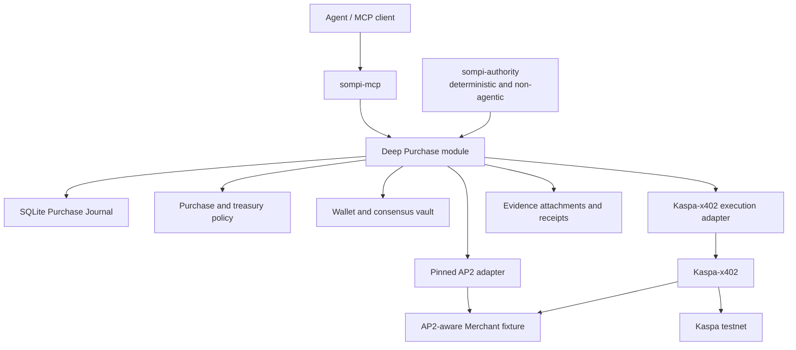
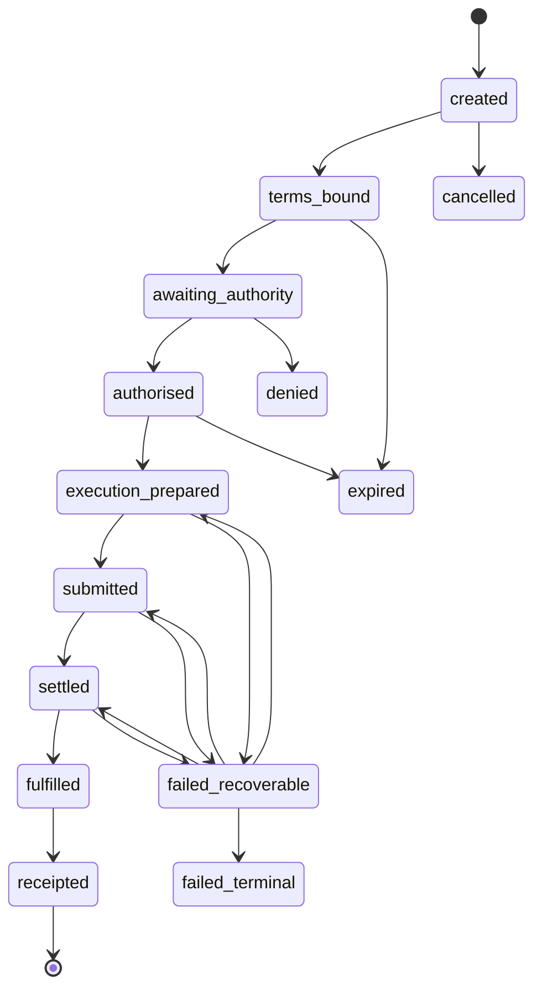
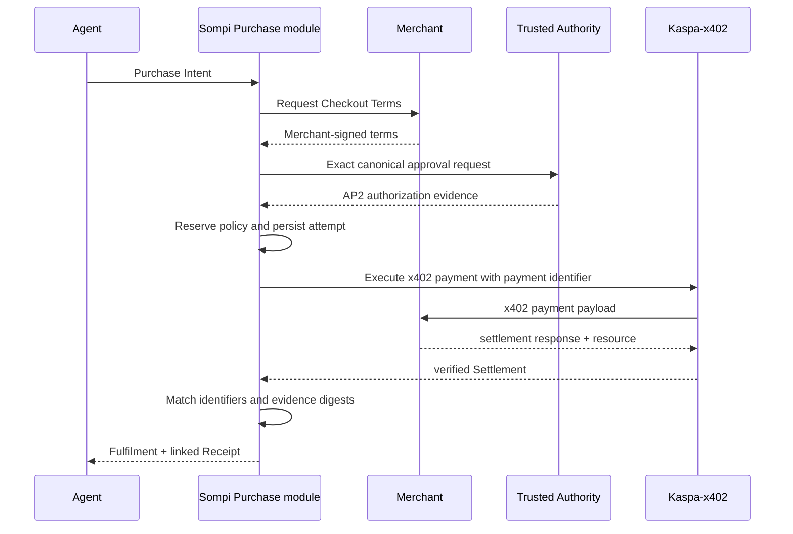

# Sompi target architecture

Status: **Accepted for implementation**

Accepted: **2026-07-11**

Applies to: the clean cutover after `ux-agent-native-payments`

## 1. Outcome

Sompi will become a modular monolith centred on one deep Purchase module. Its
stable interface is expressed in Sompi domain terms. AP2 and Kaspa-x402 sit at
separate seams so either can change without spreading protocol knowledge
through the wallet, policy, MCP tools, journal, or receipts.

The initial repository remains one TypeScript package with two production
executables and one development fixture:

- `sompi-mcp`: the agent-facing MCP executable;
- `sompi-authority`: the deterministic Trusted Authority executable;
- demo Merchant: an end-to-end/conformance fixture, not a third production
  product.

This is a clean refactor of the current product, not a greenfield rewrite and
not a compatibility-preserving migration.

## 2. Architecture



The Purchase module earns its depth by owning discovery, term binding,
authorization, policy reservation, payment preparation, execution,
reconciliation, fulfilment, receipt construction, and status projection behind
one small interface. MCP tools remain thin projections of this interface.

## 3. Ownership

| Concern | Owner | Must not leak into |
|---|---|---|
| Agent-facing tools and explanations | Sompi MCP module | AP2 or x402 adapters |
| Canonical Purchase lifecycle | Purchase module | Protocol SDK objects |
| Durable workflow and recovery | Purchase Journal | Ad-hoc JSON files |
| Purchase Authorization | Trusted Authority + AP2 adapter | Agent/LLM process |
| Treasury reservation and movement | Policy + wallet/vault modules | AP2 mandate semantics |
| HTTP payment negotiation | x402/Kaspa-x402 | Sompi-owned wire encoders |
| Kaspa signing and settlement | Kaspa-x402 + Sompi funding adapters | AP2 adapter |
| Merchant terms and fulfilment | Merchant commerce implementation | Kaspa covenant logic |
| Protocol artifacts | Evidence store | Canonical Purchase columns |

### 3.1 Explicit policy split

Sompi evaluates two different decisions:

1. **Purchase Authorization:** may this Agent buy this resource from this
   Merchant for this exact amount under these terms?
2. **Treasury Movement:** may the treasury fund or execute this exact movement,
   including explicitly bounded fees?

AP2 answers the first. Sompi policy, wallet/vault, and Kaspa-x402 funding answer
the second. A channel deposit or treasury allowance cannot stand in for later
per-resource Purchase Authorization.

## 4. Stable Purchase model

The canonical model is deliberately smaller than either protocol:

```text
Purchase
  id: PurchaseId
  intent: merchant + resource + HTTP request fingerprint
  terms: amountAtomic + asset + network + expiry + merchant identity
  authorization: status + authority identity + approved facts
  treasury: reservation + funding source + bounded fees
  paymentAttempts[]: identifier + prepared material + submission observation
  settlement: network evidence + finality + matched amount
  fulfilment: resource digest/status
  receipts[]: linked canonical receipt facts
  evidence[]: immutable protocol artifacts by digest/profile
  state: durable lifecycle state
```

Amounts are exact atomic-unit decimal strings. No floating-point value enters
policy, authorization, signing, settlement matching, or receipt construction.
Human-readable KAS values are projections only.

External protocol objects are serialized as Evidence Attachments. Canonical
fields needed for invariants are copied into version-independent columns and
verified against each attachment. This permits an adapter replacement without
migrating every historical Purchase into a new SDK object shape.

## 5. Purchase state machine

The first implementation uses the following forward path:



The exact database transition and external action are not atomically
committable together. Therefore:

1. persist canonical intent, authorization, reservation, idempotency key, and
   prepared signed bytes or their secure reference;
2. commit the planned external effect/outbox record;
3. perform the external effect;
4. persist the observation;
5. reconcile on timeout, ambiguous response, or restart.

Blind retry is forbidden after a potentially submitted blockchain transaction
or accepted Merchant payment. Reconciliation must first query the relevant
Kaspa, Kaspa-x402, and Merchant identities.

## 6. Module shape

### 6.1 MCP module

Responsibilities:

- accept agent requests and validate tool input;
- call the Purchase module;
- project deterministic Purchase state into concise agent/human responses;
- expose purchase initiation, status, recovery, and existing treasury tools;
- enforce outbound request/redirect policy before commerce discovery.

It does not sign authorization, construct AP2 credentials, parse x402 wire
objects, or directly advance payment state.

The current `paid_fetch` experience may remain as a user-facing mapping onto
Purchase initiation. Its old x402 v1 implementation and state do not remain.

### 6.2 Purchase module

Responsibilities:

- bind intent to Merchant Checkout Terms;
- verify canonical identifiers and evidence digests;
- request deterministic authorization;
- reserve and release policy capacity;
- prepare idempotent payment execution;
- drive the Kaspa-x402 adapter;
- reconcile ambiguous external outcomes;
- distinguish Settlement from Fulfilment;
- construct canonical receipts and MCP-safe status projections.

Its external interface should remain narrow. Protocol-specific seams are
internal implementation details, exercised through adapter contract tests.

### 6.3 Purchase Journal

SQLite is the authoritative workflow store from the first cutover. It owns:

- Purchase state and transition history;
- unique Purchase and payment identifiers;
- policy reservations and releases;
- outbox/planned-effect records;
- payment preparation and observations;
- Evidence Attachment metadata and digests;
- receipt facts;
- recovery leases or equivalent single-writer coordination.

SQLite should use transactions and crash-safe settings appropriate to local
payments. Schema migrations begin with this new architecture; no reader for old
Sompi x402 JSON state is required.

### 6.4 Trusted Authority

`sompi-authority` is a separate executable/process and security context. Its
interface accepts canonical, display-ready approval facts and returns approval
evidence or denial. It must:

- be deterministic and non-agentic;
- display exact Merchant, resource/request, amount, asset, network, expiry,
  fees when known, and Purchase identifier;
- validate all approval inputs independently of MCP prose;
- keep signing authority inaccessible to `sompi-mcp`;
- authenticate and bind local IPC requests and responses;
- prevent replay and cross-Purchase substitution.

The first correct authority need not use WebAuthn. The signer is an internal
seam so a passkey adapter may be added after RP identity, origin, enrolment,
recovery, and credential portability are designed and threat-modelled.

### 6.5 AP2 adapter

The AP2 adapter owns:

- exact supported AP2 profile/schema identifiers;
- AP2 parsing, deterministic verification, construction, and signing requests;
- Checkout and Payment Mandate mapping;
- AP2 receipt mapping;
- extraction of verified canonical facts into the Purchase model;
- storage of original signed AP2 artifacts as Evidence Attachments.

The initial semantic target is AP2 v0.2 human-present. Phase 1 records an exact
upstream commit/schema pin for that profile. Moving to a different AP2 version
is a deliberate adapter upgrade, not an incidental dependency refresh.

It accepts only the explicitly pinned profile and fails closed on an unknown
version or credential type. AP2 types are not re-exported from the Purchase
interface.

Human-present closed mandates are first. Autonomous/open mandates are a later
capability with separate policy and threat-model acceptance gates.

### 6.6 Kaspa-x402 adapter

The adapter consumes Kaspa-x402 through its real implementation seams,
including `FundingProvider`, `ChannelSigner`, `ChannelStore`, and
`AddressCodec`. Sompi supplies wallet/vault-backed and durable adapters where
required.

Kaspa-x402 continues to own:

- x402 v2 wire parsing and validation;
- scheme selection;
- Kaspa `exact` and later `batch-settlement` mechanics;
- transaction/voucher construction;
- settlement validation;
- its store contracts and recovery invariants.

Sompi does not copy these types or implementations. The complete existing
`src/x402/` v1 implementation, associated contracts, fixtures, scripts, state
readers, service examples, and documentation are deleted after the new exact
flow passes the cutover gate.

No Kaspa-x402 change is required for initial AP2 integration. AP2 evidence is
linked at the Purchase layer through canonical identifiers and digests.
Kaspa-x402's possible future registration beneath official x402 core is an
independent upstream-alignment task, not a Sompi dependency.

## 7. AP2 and x402 composition

AP2 and x402 are complementary:

- AP2 proves what terms were presented and what the User authorized.
- x402 negotiates and executes payment for the HTTP resource.
- Sompi proves that both refer to the same Purchase.

The initial composition does not invent a proprietary AP2-in-x402 wire format:



The binding includes at least:

- Purchase identifier and x402 payment identifier;
- Merchant identity;
- resource URL, method, and canonical request fingerprint;
- exact amount, asset, network, payee, and expiry;
- Checkout Terms digest;
- authorization evidence digest;
- x402 requirements and payment payload digests;
- Kaspa transaction/outpoint and required finality;
- Fulfilment digest;
- receipt evidence digests.

If an official AP2-compatible x402 extension becomes available, it is
implemented as a replacement adapter at the protocol seam. It is not allowed to
change canonical Purchase semantics. Temporary old/new conformance testing is
allowed during the upgrade; permanent dual runtime support is not.

Official x402 already provides an extension model and examples such as Payment
Identifier and Signed Offers & Receipts. Sompi does not require x402 to change
and does not reproduce its extension lifecycle.

## 8. Security and trust model

### Trusted

- deterministic code in the Trusted Authority;
- verified, pinned wallet/vault and Kaspa-x402 implementations within their
  documented assumptions;
- SQLite transactions and verified reconciliation logic;
- explicitly configured Merchant and network trust roots.

### Untrusted

- Agent/LLM output and MCP prose;
- Merchant responses until cryptographically and semantically verified;
- URLs, redirects, DNS results, response bodies, and extension data;
- AP2/x402 artifacts before pinned-profile validation;
- network responses and timeouts;
- process survival between any two state transitions.

### Required controls

- testnet-default and explicit mainnet denial;
- SSRF protection, redirect re-validation, private/link-local/metadata endpoint
  denial, DNS rebinding resistance, size/time limits, and method/body binding;
- exact integer amount checks and fee bounds;
- expiry and clock-skew policy;
- unique identifiers, replay protection, and idempotent recovery;
- policy reservation before signing/submission;
- evidence issuer/key verification and rotation handling;
- authority IPC authentication, freshness, and request/response binding;
- secrets excluded from logs, MCP results, journal plaintext, and evidence;
- negative tests for every cross-artifact field mismatch.

## 9. Versioning and change containment

- Pin AP2 schemas/SDK and Kaspa-x402/x402 packages exactly while unstable.
- Record dependency version or commit provenance with conformance fixtures.
- Maintain one central supported-profile declaration for AP2, x402, and
  Kaspa-x402.
- Negotiate schemes, networks, and extensions inside the corresponding adapter.
- Upgrade through deliberate changes that update the pin, adapter, fixtures,
  support declaration, and interoperability evidence together.
- Persist canonical Purchase facts plus immutable version-tagged artifacts.
- Fail closed on unknown required capabilities; ignore unknown optional data
  only where the pinned standard explicitly permits it.
- Do not build a universal `PaymentRail` interface until a second real adapter
  demonstrates a common seam.

This creates locality: AP2 churn changes the AP2 adapter; x402/Kaspa-x402 churn
changes the execution adapter; neither requires edits throughout policy,
wallet, MCP, journal, or canonical receipts.

## 10. Delivery scope

### First end-to-end release

- current working Sompi behaviour characterized;
- SQLite Purchase Journal and reconciliation;
- deep Purchase module;
- Kaspa-x402 `exact` on testnet;
- clean deletion of Sompi x402 v1;
- separate deterministic Trusted Authority;
- pinned human-present AP2 profile;
- demo Merchant;
- linked evidence and receipts;
- crash, replay, tampering, SSRF, and end-to-end tests.

### Deferred behind evidence gates

- `batch-settlement`: after exact recovery and per-Purchase authorization are
  proven;
- autonomous/open AP2 mandates: after human-present verification, escalation,
  revocation, and policy semantics are proven;
- passkeys: after authority deployment/recovery design;
- UCP: only when Sompi owns real catalog/cart/tax/order/fulfilment semantics;
- monorepo or separately published packages: only after demonstrated
  independent release/deployment requirements;
- mainnet: only after Sompi and Kaspa-x402 readiness gates, independent review,
  durable stores, recovery runbooks, and current live evidence pass.

## 11. Rejected designs

### Greenfield monorepo rewrite

Rejected because it would rewrite proven vault, wallet, MCP UX, policy, and
Kaspa knowledge while simultaneously introducing new persistence, process,
WebAuthn, package, and protocol risks. The accepted design takes its strongest
ideas—transactional state and authority isolation—without the big-bang rewrite.

### Preserve and adapt Sompi x402 v1

Rejected because no compatibility obligation exists and Kaspa-x402 owns the
better x402 v2 mechanism implementation. Keeping both creates competing sources
of protocol truth.

### Standalone Kaspa-AP2 product repository first

Rejected for this product path. AP2 is payment-method agnostic and belongs in
Sompi's authorization/evidence adapter. A future reference contribution may be
useful, but it is not required to build Sompi and must not become a competing
specification.

### AP2-specific changes in Kaspa-x402

Rejected. Kaspa-x402 is a payment mechanism and must remain reusable by clients
that do not use AP2.

### Proprietary AP2-x402 extension now

Rejected while the official integration is evolving. The initial binding is a
Sompi Purchase correlation and evidence profile, not a claim of a new wire
standard.

## 12. Normative references and current evidence

Checked when this design was accepted on 2026-07-11:

- [AP2 v0.2 specification](https://github.com/google-agentic-commerce/AP2/blob/main/docs/ap2/specification.md)
- [AP2 human-present x402 sample](https://github.com/google-agentic-commerce/AP2/tree/main/code/samples/python/scenarios/a2a/human-present/x402)
- [x402 extension model](https://docs.x402.org/extensions/overview)
- [x402 Signed Offers & Receipts](https://docs.x402.org/extensions/offer-receipt)
- [x402 network and scheme registration](https://docs.x402.org/core-concepts/network-and-token-support)
- [Kaspa-x402 repository](https://github.com/elldeeone/kaspa-x402)
- [Kaspa-x402 client seams](https://github.com/elldeeone/kaspa-x402/blob/main/packages/client/src/types.ts)
- [Kaspa-x402 server store contract](https://github.com/elldeeone/kaspa-x402/blob/main/docs/server-store-contract.md)

External documents may change. Accepted ADRs and Sompi's canonical invariants
remain authoritative until deliberately amended.
